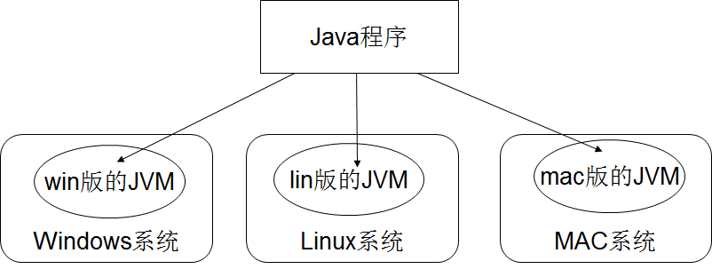
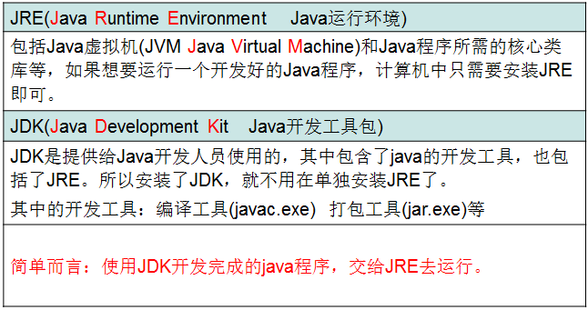
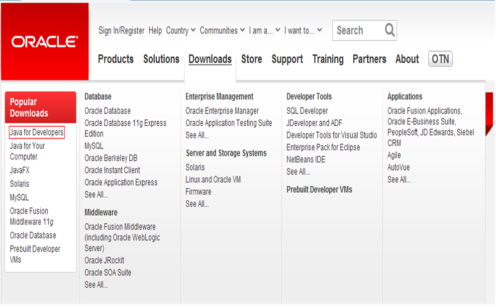
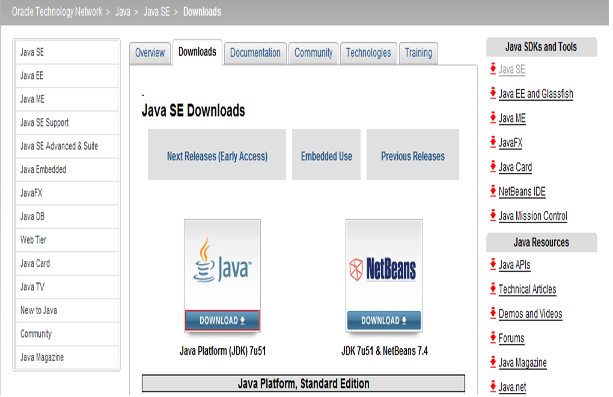
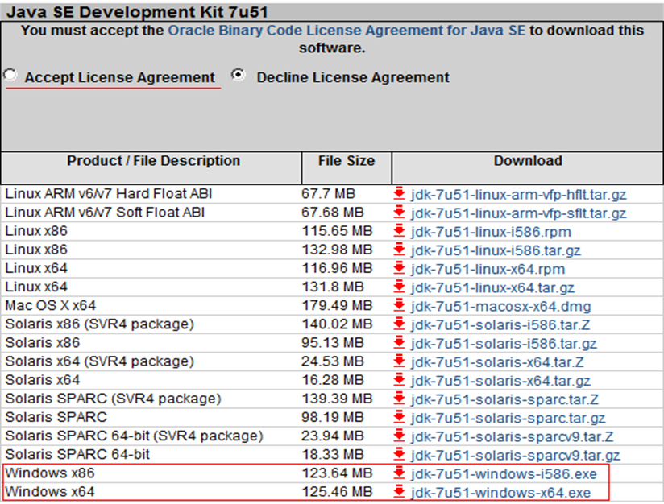

# 1. 计算机基础知识

## 1.1 计算机

计算机（Computer）全称：电子计算机，俗称电脑。是一种能够按照程序运行，自动、高速处理海量数据的现代化智能电子设备。由硬件和软件所组成，没有安装任何软件的计算机称为裸机。常见的形式有台式计算机、笔记本计算机、大型计算机等。

计算机的应用已渗透到社会的各个领域，正在改变着人们的工作、学习和生活的方式，推动着社会的发展。

计算机的应用主要在以下几个方面：

### 1.1.1 科学计算

科学计算也称数值计算。计算机最开始是为解决科学研究和工程设计中遇到的大量数学问题的数值计算而研制的计算工具。例如，人造卫星轨迹的计算，房屋抗震强度的计算，火箭、宇宙飞船的研究设计都离不开计算机的精确计算。就连我们每天收听收看的天气预报都离不开计算机的科学计算。 

### 1.1.2 数据处理

在科学研究和工程技术中，会得到大量的原始数据，其中包括大量图片、文字、声音等信息处理就是对数据进行收集、分类、排序、存储、计算、传输、制表等操作。

### 1.1.3 自动控制

自动控制是指通过计算机对某一过程进行自动操作，它不需人工干预，能按人预定的目标和预定的状态进行过程控制。例如，无人驾驶飞机、导弹、人造卫星和宇宙飞船等飞行器的控制，都是靠计算机实现的。

### 1.1.4 计算机辅助设计

计算机辅助设计(Computer Aided Design，简称CAD)是指。借助计算机的帮助，人们可以自动或半自动地完成各类工程设计工作。目前CAD技术已应用于飞机设计、船舶设计、建筑设计、机械设计、大规模集成电路设计等。在京九铁路的勘测设计中，使用计算机辅助设计系统绘制一张图纸仅需几个小时，而过去人工完成同样工作则要一周甚至更长时间。可见采用计算机辅助设计，可缩短设计时间，提高工作效率，节省人力、物力和财力，更重要的是提高了设计质量。

### 1.1.5 人工智能

人工智能(Artificial Intelligence，简称AI)是指计算机模拟人类某些智力行为的理论、技术和应用。例如，用计算机模拟人脑的部分功能进行思维学习、推理、联想和决策，使计算机具有一定“思维能力”。我国已开发成功一些中医专家诊断系统，可以模拟名医给患者诊病开方。 还有就是机器人也是计算机人工智能的典型例子。

### 1.1.6 多媒体应用

随着电子技术特别是通信和计算机技术的发展，人们已经有能力把文本、音频、视频、动画、图形和图像等各种媒体综合起来，构成一种全新的概念—“多媒体”(Multimedia)。比如一些flash广告，网页游戏等。

### 1.1.7 计算机网络

计算机网络是由一些独立的和具备信息交换能力的计算机互联构成，以实现资源共享的系统。如在全国范围内的银行信用卡的使用，火车和飞机票系统的使用等。

##1.2 计算机硬件

计算机硬件（Computer Hardware）是指计算机系统中由电子，机械和光电元件等组成的各种物理装置的总称。这些物理装置按系统结构的要求构成一个有机整体为计算机软件运行提供物质基础。

计算机通常由CPU、主板、内存、电源、主机箱、硬盘、显卡、键盘、鼠标，显示器等多个部件组成。

## 1.3 计算机软件
计算机软件是使用计算机过程中必不可少的东西，计算机软件可以使计算机按照事先预定好的顺序完成特定的功能，计算机软件按照其功能划分为系统软件与应用软件

- 系统软件： DOS(Disk Operating System), Windows, Linux, Unix, Mac, Android, iOS
- 应用软件：office  QQ聊天  YY语言  扫雷

## 1.4 软件开发

- 软件：按照特定顺序组织的计算机数据和指令的集合
- 开发：软件的制作过程
- 软件开发：借助开发工具与计算机语言制作软件

## 1.5 计算机语言

语言：人类进行沟通交流的各种表达符号，方便人与人之间进行沟通与信息交换
计算机语言：

- 人与计算机之间进行信息交流沟通的一种特殊语言
- 计算机语言中也有字符，符号等等
- 常见的计算机语言如C,C++,C#,JAVA

计算机软件都是用各种计算机语言（后面讲）编写的。最底层的叫机器语言，它由一些0和1组成，可以被某种电脑直接理解，但人就很难理解。上面一层叫汇编语言，它只能由某种电脑的汇编器软件翻译成机器语言程序，才能执行。人能够勉强理解汇编语言。人常用的语言是更上一层的高级语言，比如C，C++，C#， Java等。这些语言编写的程序一般都能在多种电脑上运行，但必须先由一个叫作编译器或者是解释器的软件将高级语言程序翻译成特定的机器语言程序。编写计算机软件的人员叫程序设计员、程序员、编程人员。他们当中的高手有时也自称为黑客。 

## 1.6 人机交互方式

软件的出现实现了人与计算机之间更好的交互。

交互方式：

- 图形化界面：这种方式简单直观，使用者易于接受，容易上手操作。
- 命令行方式：需要有一个控制台，输入特定的指令，让计算机完成一些操作。较为麻烦，需要记录住一些命令。

## 1.7 键盘功能键及快捷键介绍

键盘功能键介绍

| 功能键                | 说明               |
| :----------------- | :--------------- |
| Tab                | 制表符              |
| Shift              | 上档转换键，也可以用于中英文转换 |
| Ctrl               | 控制键，通常和其他键结合使用   |
| Alt                | 交替换挡键，更改键，替换键    |
| 空格                 | 空格键，输入空格         |
| ↑ ↓ ← →            | 上下左右方向键          |
| Enter              | 回车键              |
| PrtSc(PrintScrenn) | 屏幕截屏             |

键盘快捷键介绍

| 快捷键      | 说明   |
| :------- | :--- |
| Ctrl + A | 全选   |
| Ctrl + C | 复制   |
| Ctrl + V | 粘贴   |
| Ctrl + X | 剪切   |
| Ctrl + Z | 撤销   |
| Ctrl + S | 保存   |
| Ctrl + F | 搜索   |

## 1.8 常用的DOS命令

打开DOS命令行的方式

- 开始 → 程序 → 附件 → 命令提示符
- 开始 → 运 → cmd → 回车
- win+r → cmd →回车

| dos命令  | 功能描述                      |
| :----- | :------------------------ |
| d:  回车 | 盘符切换                      |
| cd     | 进入指定目录                    |
| cd..   | 退回到上一级目录                  |
| cd\    | 退回到根目录                    |
| md     | 创建文件夹                     |
| rd     | 删除文件夹                     |
| rd+/s  | 删除带内容的文件夹                 |
| dir    | directory，列出当前目录下的文件以及文件夹 |
| del    | 删除文件，删除一堆后缀名一样的文件*.txt    |
| cls    | clear screen，清屏           |
| exit   | 退出                        |

# 2. Java语言概述

## 2.1 Java语言发展史

Java之父-- 詹姆斯·高斯林（James Gosling）


1977年获得了加拿大卡尔加里大学计算机科学学士学位，1983年获得了美国卡内基梅隆大学计算机科学博士学位，毕业后到IBM工作，设计IBM第一代工作站NeWS系统，但不受重视。后来转至Sun公司，1990年，与Patrick，Naughton和Mike Sheridan等人合作“绿色计划”，后来发展一套语言叫做“Oak”，后改名为Java。

## 2.2 Java语言平台版本

- J2SE(Java 2 Platform Standard Edition)标准版

  是为开发普通桌面和商务应用程序提供的解决方案，该技术体系是其他两者的基础，可以完成一些桌面应用程序的开发

- J2ME(Java 2 Platform Micro Edition)小型版

  是为开发电子消费产品和嵌入式设备提供的解决方案

- J2EE(Java 2 Platform Enterprise Edition)企业版

  是为开发企业环境下的应用程序提供的一套解决方案，该技术体系中包含的技术如 Servlet、Jsp等，主要针对于Web应用程序开发

## 2.3 Java语言特点

- 简单性：解释性
- 面向对象：高性能
- 分布式处理：多线程
- 健壮性：动态
- 结构中立：安全性
- 开源
- 跨平台

## 2.4 跨平台性

- 什么是跨平台性？

通过Java语言编写的应用程序在不同的系统平台上都可以运行。

- 原理是什么？

只要在需要运行java应用程序的操作系统上，先安装一个Java虚拟机(JVM Java Virtual Machine)即可。由JVM来负责Java程序在该系统中的运行。



因为有了JVM，所以同一个Java程序在三个不同的操作系统中都可以执行。这样就实现了Java程序的跨平台性。也称为Java具有良好的可移植性。

PS：Java语言是跨平台的，而JVM不是跨平台的。

## 2.5 JDK与JRE



# 3. JDK的下载,安装

通过官方网站获取JDK：http://www.oracle.com
针对不同操作系统，下载不同的JDK版本：识别计算机的操作系统

JDK的下载步骤图1



JDK的下载步骤图2



JDK的下载步骤图3



## 3.1 JDK的安装
傻瓜式安装，下一步即可。
建议：安装路径不要有中文或者特殊符号如空格等。最好目录统一。
当提示安装JRE时，可以选择不安装。

# 4. HelloWorld案例

## 4.1 开发工具介绍

- 编写Java程序可以使用很多种工具
- notepad(微软操作系统自带)
- Notepad++
- Eclipse
- MyEclipse

## 4.2 HelloWorld

- 首先定义一个类：class 类名
- 在类定义后加上一对大括：{  }
- 在大括号中间添加一个主(main)方法/函数

```java
public static void main(String [] args){ 
}
```

在主方法的大括号中间添加一行输出语句

```java
System.out.println(“hello world”);
```

```java
class HelloWorld {
     public static void main(String [] args){
         System.out.println(“Hello World”);
    }
}
```

## 4.3 程序解析

- 首先编写java源代码程序，扩展名.java
- 在命令行模式中，输入javac命令对源代码进行编译，生成字节码文件
- javac 源文件名.java
- 编译完成后，如果没有报错信息，输入java命令对class字节码文件进行解释运行,执行时不需要添加.class扩展名
- java HelloWorld

## 4.4 运行与工作原理


## 4.5 常见错误

- 文件扩展名隐藏导致编译失败
- class写错Class claas…
- 类名格式有问题暂时全部使用英文
- 类名后面的大括号匹配不正确
- main方法格式错误

```java
public static void main(String [] args){ 
}
```
- main方法大括号缺失
- 打印语句拼写错误

```java
 System.out.println(“”);
```

- 引号使用错误，使用成中文全角引号

# 5. 环境变量的配置

## 5.1 path环境变量配置的作用

- 程序的执行需要使用外部指令javac，但是javac指令仅仅能在JDK安装目录下的bin目录下时候，因此程序只能写入bin目录
- 程序开发过程中，不能将源代码写入JDK的安装目录，因此需要将源程序保存到任意位置的指定目录(英文目录)，所以需要使javac指令在任意目录下可以运行

### 5.1.1 path环境变量配置方式1

通过配置path环境变量，将javac指令所在目录也就是JDK安装目录下的bin目录配置到path变量下，即可使javac指令在任意目录下运行

win7，win8系统：右键`点击桌面计算机` → `选择属性` → `选择高级系统设置` → `选择高级选项卡` → `点击环境变量` → `下方系统变量` 中查找 `path` → `双击path`

XP系统：右键点击桌面计算机→选择属性→选择高级选项卡→点击环境变量→下方系统变量中查找path→双击path

将jdk安装目录下的bin目录添加到最左边并添加分号

### 5.1.2 path环境变量配置方式2
path环境变量的参照形配置方式

- 创建新的变量名称：JAVA_HOME
- 为JAVA_HOME添加变量值：JDK安装目录
- 将path环境变量中JDK目录修改：%JAVA_HOME%\bin;
- path环境变量具有先后顺序

### 5.1.3 classpath环境变量配置方式
classpath环境变量配置方式

- 创建新的变量名称：classpath
- 值设定为指定的还有class文件的目录，多个目录间使用分号(;)分割
- 作用：使classpath目录中的.class文件可以在任意目录运行

技巧：通常将配置的目录最前面添加.配置，即便当前目录，使.class文件搜索时首先搜索当前目录，然后根据目录配置的顺序依次查找，找到后即运行，因此classpath目录中的配置存在先后顺序

## 5.2 path和classpath的区别

- path环境变量里面记录的是可执行性文件，如.exe文件，对可执行文件先在当前路径去找，如果没找到就去path环境变量中配置的路径去找
- classpath环境变量里记录的是java类的运行文件所在的目录