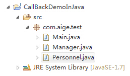
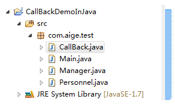

所谓回调，在实现具有通用性质的应用框架时非常常见：

## 接口回调

> 原文链接：http://blog.csdn.net/aigestudio/article/details/40869893

废话不多说，像许多网上介绍回调机制的文章一样，我这里也以一个现实的例子开头：假设你公司的总经理出差前需要你帮他办件事情，这件事情你需要花些时间去做，这时候总经理肯定不能守着你做完再出差吧，于是就他告诉你他的手机号码叫你如果事情办完了你就打电话告诉他一声；这是一个现实生活中常能碰到的例子，我们用呢就用代码的方式来实现一个这个过程，看一下这个过程究竟是怎样的。

首先在Eclipse中新建一个Java项目：CallBackDemoInJava

然后再新建三个类：Manager（该类用来模拟总经理），Personnel（该类用来模拟员工），Main（主类）



Manager的代码如下：

```java
package com.aige.test;  

/** 
 * @description 该类用来模拟总经理
 */  
public class Manager {  
    /** 
     * @param personnel 传入一个员工类的对象 
     */  
    public Manager(Personnel personnel) {  
        // 想让该让员工做什么  
        personnel.doSomething(this, "整理公司文件");  
    }  

    /** 
     * @description 当员工做完总经理让他做的事后就通过该方法通知总经理 
     * @param result 事情结果 
     */  
    public void phoneCall(String result) {  
        System.out.println("事情" + result);  
    }  
}  
```

Manager类是个模拟总经理的类，当该类的对象被造出来后就会通过Personnel的对象去执行Personnel中的doSomething方法告诉员工做些什么

Personnel的代码如下：

```java
package com.aige.test;  

/** 
 * @description 该类用来模拟员工
 */  
public class Personnel {  
    public void doSomething(Manager manager, String task) { 
        // 总经理通过doSomething方法告诉员工要做什么  
        System.out.println("总经理要你做" + task);  
        String result = "做完了";  
        // 当事情做完了我们就通过总经理公布的phoneCall方法通知总经理结果  
        manager.phoneCall(result);  
    }  
}  
```

总经理通过调用Personnel中的doSomething方法告诉员工该做些什么，当员工做完后就通过Manager中的phoneCall方法通知总经理结果

那么好的！万事俱备，我们在Main中测试运行下代码看看结果：

```java
package com.aige.test;  

public class Main {  
    public static void main(String[] args) {  
        // 首先我们需要一个员工  
        Personnel personnel = new Personnel();  
        // 其次把这个员工指派给总经理  
        new Manager(personnel);  
    }  
}  
```

代码执行结果如下：


回到我们刚才举的那个现实中的例子：总经理出差前要你去办件事情，这件事情通过doSomething告诉你了，事情要是办完了就打总经理的电话phoneCall通知他一声。这里的phoneCall我们就称为回调方法，为什么称之为回调呢？你问我我也不清楚哈，这你得问Sun公司了，不过我们从代码的执行过程可以看出数据的流向大致是Manager → Personnel → Manager，这不就是一个“回调”的过程么？现在我们来总结下满足回调的两个基本条件：

- Class A调用Class B中的X方法
- ClassB中X方法执行的过程中调用Class A中的Y方法完成回调

一切看上去都很完美，以上例子代码简单通俗地描述了回调，但是这里我就会有这样一个疑问：假设总经理出差前交了件事情给我去办，不巧……副总经理也要给我件事去办，更无耻的是……主管也发任务过来了，都要求说做完就打电话通知他们……这时我们就要定义更多类，什么总经理类啦、经理类啦、主管类啦、杂七杂八的类，但是这些杂七杂八的大爷们都要求做完事情就电话通知，每个类都会有一个类似phoneCall的方法作为回调方法，这时，我们利用面向对象的思想来看，是不是可以把这个回调方法抽象出来作为一个独立的抽象类或接口呢？多态的思想油然而生，鉴于JAVA接口的好处，我们就定义一个名为CallBack的接口作为回调接口，再在该接口下定义一个名为backResult的抽象方法作为回调方法，让那些总经理类啦、经理类啦、主管类啦、什么的都去实现该接口，这时候我们就来改造下我们的项目：



CallBack代码如下：

```java
package com.aige.test;  

/** 
 * @description 回调接口
 */  
public interface CallBack {  
    // 回调方法  
    public void backResult(String result);  
} 
```
Manager代码改造后如下：实现CallBack接口重写backResult方法
```java
package com.aige.test;  

/** 
 * @description 该类用来模拟总经理
 */  
public class Manager implements CallBack {  
    /** 
     * @param personnel  传入一个员工类的对象 
     */  
    public Manager(Personnel personnel) {  
        // 想让该让员工做什么  
        personnel.doSomething(this, "整理公司文件");  
    }  

    /** 
     * @description 当员工做完总经理让他做的事后就通过该方法通知总经理 
     * @param result 事情结果 
     */  
    public void backResult(String result) {  
        System.out.println("事情" + result);  
    }  
}  
```

Personnel代码改造后如下：doSomething方法不再传入一个Manager对象而是一个CallBack接口

```java
package com.aige.test;  

/** 
 * @description 该类用来模拟员工
 */  
public class Personnel {  
    public void doSomething(CallBack callBack, String task) {  
        // 总经理通过doSomething方法告诉员工要做什么  
        System.out.println("总经理要你做" + task);  
        String result = "做完了"; 
        // 当事情做完了我们就通过总经理公布的phoneCall方法通知总经理结果  
        callBack.backResult(result);  
    }  
}  
```

Main代码不变，执行结果也是一样的。

至此，回调的基本概念差不多就是这样了~其实回调真心不难理解，但是回调在Android中相当重要，几乎处处可见回调机制，如果你能理解到回调的奥秘~我相信对你的Android技术是一个不小的提升

## 接口回调机制

接口回调就是一个通知机制，作用:

1. 单纯的通知
2. 通知+传值

步骤:

1. 定义接口以及接口方法
2. 定义接口对象
3. 在某一个地方，接口对象调用接口方法
4. 暴露接口对象(构造方法，setter方法)

代码示例

```java
// 1.定义接口,以及接口方法
public interface OnTeacherComeListener {
	void onTeachCome(String teacherName);
	void onTeachCome();
}
```

```java
public class ClassMate {
	// 2.定义接口对象
	OnTeacherComeListener	mOnTeacherComeListener;

	// 方式1:通过构造方法赋值
	public ClassMate(OnTeacherComeListener onTeacherComeListener) {
		super();
		mOnTeacherComeListener = onTeacherComeListener;
	}

	public ClassMate() {
		super();
	}

	// 模拟老师来了
	public void doTeacherCome(String teacherName) {
		// 3.在某一个地方.接口对象调用接口方法-->老师来了的时候
		mOnTeacherComeListener.onTeachCome(teacherName);
	}

	// 4.暴露接口对象(构造方法,setter方法)

	// 方式2:通过setter赋值
	public void setOnTeacherComeListener(OnTeacherComeListener onTeacherComeListener) {
		mOnTeacherComeListener = onTeacherComeListener;
	}
}
```

```java
public class Me {
	private Timer	mTimer;

	/**想睡觉*/
	public void wantSleep() {
		System.out.println("昨晚敲代码敲到4点钟,突然想睡觉...");
	}

	/**开始睡觉*/
	public void startSleep() {
		mTimer = new Timer();
		mTimer.schedule(new TimerTask() {

			@Override
			public void run() {
				System.out.println("开始呼呼大睡.........");
			}
		}, 0, 1000);
	}

	/**停止睡觉*/
	public void stopSleep() {
		if (mTimer != null) {
			mTimer.cancel();
			mTimer = null;
			System.out.println("停止了睡觉");
		}
	}
}
```
我想要睡觉，但是睡觉前我跟同桌说，伍老师来了把我叫醒，要是李老师来了不用管，继续睡
```java
public class Test {
	public static void main(String[] args) {
		final Me me = new Me();

		// 我想睡觉
		me.wantSleep();
		// 找到一个同桌
		ClassMate classMate = new ClassMate();
		System.out.println("我去和同桌协商......");
		// 和他商量好-->如果老师来了.你拍醒我.让我停止睡觉
		classMate.setOnTeacherComeListener(new OnTeacherComeListener() {

			@Override
			public void onTeachCome(String teacherName) {// 通知+传值的效果
				if ("伍老师".equals(teacherName)) {// 回调过程中.有传值的效果
					System.out.println("伍老师不是班主任,我继续睡觉");
				} else if ("李老师".equals(teacherName)) {
					me.stopSleep();//
				}
			}

			@Override
			public void onTeachCome() {// 通知
			}
		});
		// 模拟商量了2s钟
		try {
			Thread.sleep(2000);
		} catch (InterruptedException e) {
			e.printStackTrace();
		}
		// 开始睡觉
		me.startSleep();

		// 模拟伍老师来了.
		try {
			Thread.sleep(10000);
		} catch (InterruptedException e) {
			e.printStackTrace();
		}

		classMate.doTeacherCome("伍老师");
		// 模拟伍老师来了.
		try {
			Thread.sleep(10000);
		} catch (InterruptedException e) {
			e.printStackTrace();
		}
		classMate.doTeacherCome("李老师");

	}
}
```
## 同步、异步、回调、轮询

- 同步

好比你去麦当劳点餐，你说“来个汉堡”，服务员告诉你，对不起，汉堡要现做，需要等5分钟，于是你站在收银台前面等了5分钟，拿到汉堡再去逛商场，这是同步。

- 异步

你说“来个汉堡”，服务员告诉你，汉堡需要等5分钟，你可以先去逛商场，等做好了，我们再通知你，这样你可以立刻去干别的事情（逛商场），这是异步

- 回调、轮询

很明显，使用异步来编写程序性能会远远高于同步，但是异步的缺点是编程模型复杂。想想看，你得知道什么时候通知你“汉堡做好了”，而通知你的方法也各不相同。如果是服务员跑过来找到你，这是回调模式，如果服务员发短信通知你，你就得不停地检查手机，这是轮询模式。总之，异步的复杂度远远高于同步