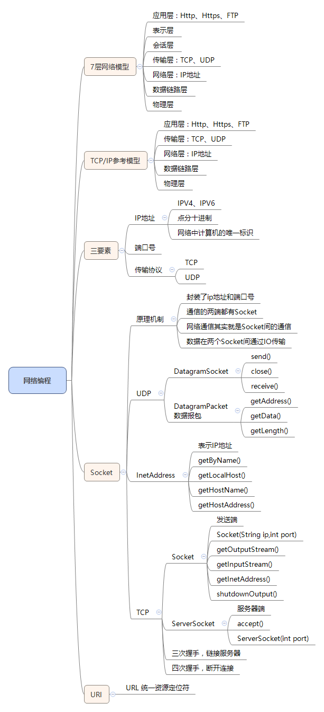
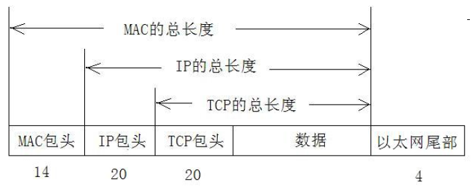
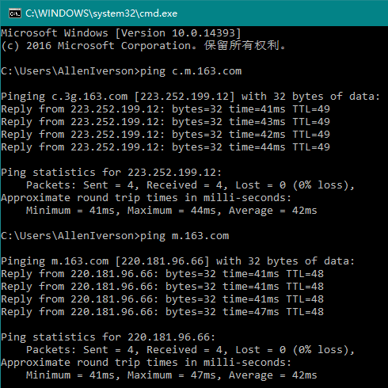
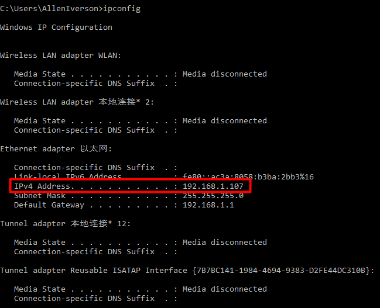
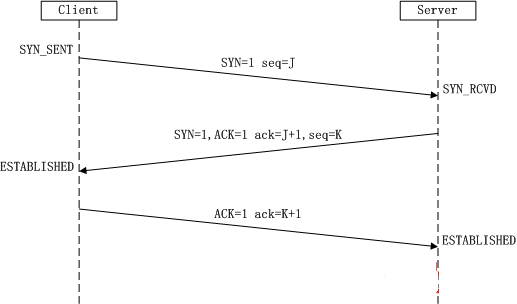
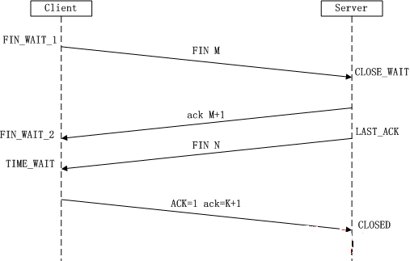
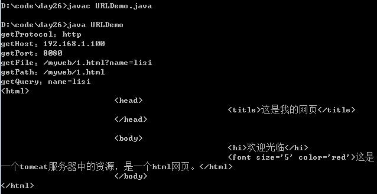

# **1. 网络编程概述**

自从互联网诞生以来，现在基本上所有的程序都是网络程序，很少有单机版的程序了。

计算机网络就是把各个计算机连接到一起，让网络中的计算机可以互相通信。网络编程就是如何在程序中实现两台计算机的通信。

举个例子，当你使用浏览器访问新浪网时，你的计算机就和新浪的某台服务器通过互联网连接起来了，然后，新浪的服务器把网页内容作为数据通过互联网传输到你的电脑上。

由于你的电脑上可能不止浏览器，还有QQ、Skype、Dropbox、邮件客户端等，不同的程序连接的别的计算机也会不同，所以，更确切地说，网络通信是两台计算机上的两个进程之间的通信。比如，浏览器进程和新浪服务器上的某个Web服务进程在通信，而QQ进程是和腾讯的某个服务器上的某个进程在通信。


## **1.1 计算机网络**

是指将地理位置不同的具有独立功能的多台计算机及其外部设备，通过通信线路连接起来，在网络操作系统，网络管理软件及网络通信协议的管理和协调下，实现资源共享和信息传递的计算机系统。

## **1.2 网络编程**

就是用来实现网络互连的不同计算机上运行的程序间可以进行数据交换。

## **1.3 网络模型**

计算机网络之间以何种规则进行通信，就是网络模型研究问题。

网络模型一般是指OSI（Open System Interconnection开放系统互连）参考模型或者TCP/IP参考模型。

- 应用层：http、https、ftp、smtp
- 安全层：TSL、SSL
- 传输层：TCP、UDP
- 网络层：IP
- 数据链路层
- 物理层


## **1.4 网络模型7层概述**
- **物理层**

主要定义物理设备标准，如网线的接口类型、光纤的接口类型、各种传输介质的传输速率等。它的主要作用是传输比特流（就是由1、0转化为电流强弱来进行传输，到达目的地后在转化为1、0，也就是我们常说的数模转换与模数转换）。这一层的数据叫做比特。

- **数据链路层**

主要将从物理层接收的数据进行MAC地址（网卡的地址）的封装与解封装。常把这一层的数据叫做帧。在这一层工作的设备是交换机，数据通过交换机来传输。

- **网络层**

主要将从下层接收到的数据进行IP地址（例192.168.0.1)的封装与解封装。在这一层工作的设备是路由器，常把这一层的数据叫做数据包。

- **传输层**

定义了一些传输数据的协议和端口号（WWW端口80等），如：TCP（传输控制协议，传输效率低，可靠性强，用于传输可靠性要求高，数据量大的数据），UDP（用户数据报协议，与TCP特性恰恰相反，用于传输可靠性要求不高，数据量小的数据，如QQ聊天数据就是通过这种方式传输的）。 主要是将从下层接收的数据进行分段和传输，到达目的地址后再进行重组。常常把这一层数据叫做段。

- **会话层**

通过传输层（端口号：传输端口与接收端口）建立数据传输的通路。主要在你的系统之间发起会话或者接受会话请求（设备之间需要互相认识可以是IP也可以是MAC或者是主机名）

- **表示层**

主要是进行对接收的数据进行解释、加密与解密、压缩与解压缩等（也就是把计算机能够识别的东西转换成人能够能识别的东西（如图片、声音等）。

- **应用层**

主要是一些终端的应用，比如说FTP（各种文件下载），WEB（IE浏览），QQ之类的（可以把它理解成我们在电脑屏幕上可以看到的东西．就是终端应用）。

**PS：**

- 每个网卡的MAC地址都是全球唯一的
- 路由器实现将数据包发送到指定的地点
- 应用软件之间通信的过程就是层与层之间封包、解封包的过程
- OSI参考模型虽然设计精细，但过于麻烦，效率不高，因此才产生了简化版的TCP/IP参考模型

## **1.5 封包、解封包的过程**


在TCP/IP协议模型的4层协议中，各层数据包封装情况如图所示。在发送数据时，将数据从最上层到最下层一次打包（加上
包头和部分尾部信息）；在接收数据时，则将从数据从最下层到最上层依次拆包（去掉包头和部分尾部信息）。这些打包和
拆包操作就是由TCP/IP协议栈实现的。下面根据实例对上述包头进行详细分析。



# **2. 网络编程三要素**
网络模型说完了，我们要进行通讯，需要哪些要素呢?

比如说：我要跟你说话
第一个条件：我要先找到你 (IP)
第二个条件：你得有接收数据的地方，耳朵 (端口)
第三个条件：我跟你说话，你能接收到，咱按什么方式接收啊，我说英文你懂吗，说韩文你懂吗，不懂是吧，所以我还是说中文把(协议)

## **2.1 IP地址**

网络中计算机的唯一标识，不易记忆，可用主机名。本地回环地址：127.0.0.1，主机名：localhost。计算机只能识别二进制的数据，所以我们的IP地址应该是一个二进制的数据。为了方便表示IP地址，我们就把IP地址的每一个字节上的数据换算成十进制，然后用.分开来表示："点分十进制"。

所谓IP地址就是给每个连接在Internet上的主机分配的一个32bit地址。按照TCP/IP规定，IP地址用二进制来表示，每个IP地址长32bit，比特换算成字节，就是4个字节。例如一个采用二进制形式的IP地址是“00001010000000000000000000000001”，这么长的地址，人们处理起来也太费劲了。为了方便人们的使用，IP地址经常被写成十进制的形式，中间使用符号“.”分开不同的字节。于是，上面的IP地址可以表示为“10.0.0.1”。IP地址的这种表示法叫做“点分十进制表示法”，这显然比1和0容易记忆得多。

## 2.2 IP地址分类

IP地址的组成：IP地址 = 网络号码+主机地址

IPV4数量已经不够分配，所以产生了IPV6。


## 2.3 ping命令

通过ping 127.0.0.1可以测试网络是不是通，如果不通，可能是网卡出问题了


通过ping命令还可以获取到url对应的IP地址，例如获取网易新闻url（c.m.163.com）的IP地址



查看本机IP地址ipconfig



## 2.4 InetAddress类的使用

此类表示互联网协议 (IP) 地址

| 返回值         | 方法                     | 说明                        |
| :---------- | :--------------------- | :------------------------ |
| InetAddress | getByName(String host) | 根据主机名或者IP地址的字符串表示得到IP地址对象 |
| String      | getHostName()          | 获取此 IP 地址的主机名             |
| String      | getHostAddress()       | 返回 IP 地址字符串               |

代码示例：
```java
package cn.itcast_01;
import java.net.InetAddress;
import java.net.UnknownHostException;
public class InetAddressDemo {
	public static void main(String[] args) throws UnknownHostException {
		// public static InetAddress getByName(String host)
		// InetAddress address = InetAddress.getByName("liuyi");
		// InetAddress address = InetAddress.getByName("192.168.12.92");
		InetAddress address = InetAddress.getByName("192.168.12.63");

		// 获取两个东西：主机名，IP地址
		// public String getHostName()
		String name = address.getHostName();
		// public String getHostAddress()
		String ip = address.getHostAddress();
		System.out.println(name + "---" + ip);
	}
}
```

运行结果：


## **2.2 端口号**

正在运行的程序的标识，用于标识进程的逻辑地址，不同进程的标识。有效端口：0~65535，其中0~1024系统使用或保留端口。

端口分为：物理端口，网卡口；逻辑端口，我们指的就是逻辑端口。

- A：每个网络程序都会至少有一个逻辑端口
- B：用于标识进程的逻辑地址，不同进程的标识
- C：有效端口：0~65535，其中0~1024系统使用或保留端口。
- D：所谓防火墙，其功能就是将发送到某程序端口的数据屏蔽掉以及将从该程序端口发出的数据也屏蔽掉。


## **2.3 传输协议**

传输协议就是通讯的规则，常见协议：TCP，UDP。

UDP将数据源和目的封装成数据包中，不需要建立连接；每个数据报的大小在限制在64k；因无连接，是不可靠协议；不需要建立连接，速度快

TCP建立连接，形成传输数据的通道；在连接中进行大数据量传输；通过三次握手完成连接，是可靠协议；必须建立连接，效率会稍低

UDP和TCP的特点

- UDP：面向无连接；不可靠；速度快；将数据封包传输，数据包最大64k 
  举例：聊天留言，在线视频，视频会议，发短信，邮局包裹。
- TCP：面向连接；安全可靠效率稍低；通过三次握手确保连接的建立。 
  举例：下载，打电话，QQ聊天(你在线吗，在线，就回应下，就开始聊天了)

## **2.4 域名解析**

在浏览器中输入新浪的域名，DNS解析域名成IP，然后计算机再通过获取到的IP访问新浪服务器。

域名解析，最先走是本地的hosts（C:\WINDOWS\system32\drivers\etc\hosts）文件，解析失败了，才去访问DNS服务器解析、获取IP地址。


```java
import java.net.InetAddress;
import java.net.UnknownHostException;

public class IPDemo
{
    public static void main(String[] args) throws UnknownHostException {

        InetAddress ip = InetAddress.getLocalHost();

        ip = InetAddress.getByName("192.168.1.110");

        System.out.println(ip.getHostAddress());
        System.out.println(ip.getHostName());
    }
}
```
运行结果


应用：通过hosts文件可以屏蔽游戏网站内容弹出，例如：在hosts文件中添加，`127.0.0.1 www.game18.com`

# **3. Socket套接字**

## **3.1 Socket套接字**
网络上具有唯一标识的IP地址和端口号组合在一起才能构成唯一能识别的标识符套接字。
## **3.2 Socket原理机制**
- 通信的两端都有Socket
- 网络通信其实就是Socket间的通信
- 数据在两个Socket间通过IO传输

## **3.3 Socket机制图解**

# **4. UDP编程**
UDP：UDP 协议全称是用户数据报协议，在网络中它与TCP 协议一样用于处理数据包，是一种无连接的协议。在OSI 模型中，在第四层——传输层，处于IP 协议的上一层。UDP 有不提供数据包分组、组装和不能对数据包进行排序的缺点，也就是说，当报文发送之后，是无法得知其是否安全完整到达的。UDP 用来支持那些需要在计算机之间传输数据的网络应用。包括网络视频会议系统在内的众多的客户/服务器模式的网络应用都需要使用UDP协议。UDP 协议从问世至今已经被使用了很多年，虽然其最初的光彩已经被一些类似协议所掩盖，但是即使是在今天UDP 仍然不失为一项非常实用和可行的网络传输层协议。

## **4.1 UDP传输**

- DatagramSocket与DatagramPacket
- 建立发送端，接收端
- 建立数据包
- 调用Socket的发送接收方法
- 关闭Socket
- 发送端与接收端是两个独立的运行程序

## **4.2 DatagramSocket**

此类表示用来发送和接收数据报包的套接字

数据报套接字是包投递服务的发送或接收点。每个在数据报套接字上发送或接收的包都是单独编址和路由的。从一台机器发送到另一台机器的多个包可能选择不同的路由，也可能按不同的顺序到达

在 DatagramSocket 上总是启用 UDP 广播发送。为了接收广播包，应该将 DatagramSocket 绑定到通配符地址。在某些实现中，将 DatagramSocket 绑定到一个更加具体的地址时广播包也可以被接收。

构造方法

```java
DatagramSocket(int port) // 创建数据报套接字并将其绑定到本地主机上的指定端口
DatagramSocket(int port, InetAddress laddr) // 创建数据报套接字，将其绑定到指定的本地地址
```

UDP传输-发送端思路

- 建立udp的socket服务
- 将要发送的数据封装成数据包
- 通过udp的socket服务，将数据包发送出
- 关闭资源

```java
package cn.itcast_02;

import java.io.IOException;
import java.net.DatagramPacket;
import java.net.DatagramSocket;
import java.net.InetAddress;
/*
 * UDP协议发送数据：
 * A:创建发送端Socket对象
 * B:创建数据，并把数据打包
 * C:调用Socket对象的发送方法发送数据包
 * D:释放资源
 */
public class SendDemo {
	public static void main(String[] args) throws IOException {
		// 创建发送端Socket对象
		// DatagramSocket()
		DatagramSocket ds = new DatagramSocket();

		// 创建数据，并把数据打包
		// DatagramPacket(byte[] buf, int length, InetAddress address, int port)
		// 创建数据
		byte[] bys = "hello,udp,我来了".getBytes();
		// 长度
		int length = bys.length;
		// IP地址对象
		InetAddress address = InetAddress.getByName("192.168.12.92");
		// 端口
		int port = 10086;
		DatagramPacket dp = new DatagramPacket(bys, length, address, port);

		// 调用Socket对象的发送方法发送数据包
		// public void send(DatagramPacket p)
		ds.send(dp);

		// 释放资源
		ds.close();
	}
}
```

## **4.3 DatagramPacket**
此类表示数据报包。数据报包用来实现无连接包投递服务。每条报文仅根据该包中包含的信息从一台机器路由到另一台机器。从一台机器发送到另一台机器的多个包可能选择不同的路由，也可能按不同的顺序到达。不对包投递做出保证。

构造方法

- DatagramPacket(byte[] buf, int length) 
  构造 DatagramPacket，用来接收长度为 length 的数据包

- DatagramPacket(byte[] buf, int length, InetAddress address, int port) 
  构造数据报包，用来将长度为 length 的包发送到指定主机上的指定端口号

- DatagramPacket(byte[] buf, int offset, int length, InetAddress address, int port) 
  构造数据报包，用来将长度为 length 偏移量为 offset 的包发送到指定主机上的指定端口号

UDP传输-接收端思路

- 建立udp的socket服务
- 通过receive方法接收数据
- 将收到的数据存储到数据包对象中
- 通过数据包对象的功能来完成对接收到数据进行解析
- 可以对资源进行关闭

```java
package cn.itcast_02;

import java.io.IOException;
import java.net.DatagramPacket;
import java.net.DatagramSocket;
import java.net.InetAddress;

/*
 * UDP协议接收数据：
 * A:创建接收端Socket对象
 * B:创建一个数据包(接收容器)
 * C:调用Socket对象的接收方法接收数据
 * D:解析数据包，并显示在控制台
 * E:释放资源
 */
public class ReceiveDemo {
	public static void main(String[] args) throws IOException {
		// 创建接收端Socket对象
		// DatagramSocket(int port)
		DatagramSocket ds = new DatagramSocket(10086);

		// 创建一个数据包(接收容器)
		// DatagramPacket(byte[] buf, int length)
		byte[] bys = new byte[1024];
		int length = bys.length;
		DatagramPacket dp = new DatagramPacket(bys, length);

		// 调用Socket对象的接收方法接收数据
		// public void receive(DatagramPacket p)
		ds.receive(dp); // 阻塞式

		// 解析数据包，并显示在控制台
		// 获取对方的ip
		// public InetAddress getAddress()
		InetAddress address = dp.getAddress();
		String ip = address.getHostAddress();
		// public byte[] getData():获取数据缓冲区
		// public int getLength():获取数据的实际长度
		byte[] bys2 = dp.getData();
		int len = dp.getLength();
		String s = new String(bys2, 0, len);
		System.out.println(ip + "传递的数据是:" + s);

		// 释放资源
		ds.close();
	}
}
```

运行结果：


## **4.4 UDP案例**

从键盘录入数据进行发送，如果输入的是886那么客户端就结束输入数据。

发送端

```java
package cn.itcast_04;

import java.io.BufferedReader;
import java.io.IOException;
import java.io.InputStreamReader;
import java.net.DatagramPacket;
import java.net.DatagramSocket;
import java.net.InetAddress;

/*
 * 数据来自于键盘录入
 * 键盘录入数据要自己控制录入结束。
 */
public class SendDemo {
	public static void main(String[] args) throws IOException {
		// 创建发送端的Socket对象
		DatagramSocket ds = new DatagramSocket();

		// 封装键盘录入数据
		BufferedReader br = new BufferedReader(new InputStreamReader(System.in));
		String line = null;
		while ((line = br.readLine()) != null) {
			if ("886".equals(line)) {
				break;
			}

			// 创建数据并打包
			byte[] bys = line.getBytes();
			// DatagramPacket dp = new DatagramPacket(bys, bys.length,
			// InetAddress.getByName("192.168.12.92"), 12345);
			DatagramPacket dp = new DatagramPacket(bys, bys.length,
					InetAddress.getByName("192.168.12.255"), 12345);

			// 发送数据
			ds.send(dp);
		}

		// 释放资源
		ds.close();
	}
}
```

运行结果：


接收端

```java
package cn.itcast_04;

import java.io.IOException;
import java.net.DatagramPacket;
import java.net.DatagramSocket;

/*
 * 多次启动接收端：
 * 		java.net.BindException: Address already in use: Cannot bind
 * 		端口被占用。
 */
public class ReceiveDemo {
	public static void main(String[] args) throws IOException {
		// 创建接收端的Socket对象
		DatagramSocket ds = new DatagramSocket(12345);

		while (true) {
			// 创建一个包裹
			byte[] bys = new byte[1024];
			DatagramPacket dp = new DatagramPacket(bys, bys.length);

			// 接收数据
			ds.receive(dp);

			// 解析数据
			String ip = dp.getAddress().getHostAddress();
			String s = new String(dp.getData(), 0, dp.getLength());
			System.out.println("from " + ip + " data is : " + s);
		}

		// 释放资源
		// 接收端应该一直开着等待接收数据，是不需要关闭
		// ds.close();
	}
}
```

运行结果：


# **5. TCP编程**

## 5.1 TCP/IP协议

虽然大家现在对互联网很熟悉，但是计算机网络的出现比互联网要早很多。

计算机为了联网，就必须规定通信协议，早期的计算机网络，都是由各厂商自己规定一套协议，IBM、Apple和Microsoft都有各自的网络协议，互不兼容，这就好比一群人有的说英语，有的说中文，有的说德语，说同一种语言的人可以交流，不同的语言之间就不行了。

为了把全世界的所有不同类型的计算机都连接起来，就必须规定一套全球通用的协议，为了实现互联网这个目标，互联网协议簇（Internet Protocol Suite）就是通用协议标准。Internet是由inter和net两个单词组合起来的，原意就是连接“网络”的网络，有了Internet，任何私有网络，只要支持这个协议，就可以联入互联网。

因为互联网协议包含了上百种协议标准，但是最重要的两个协议是TCP和IP协议，所以，大家把互联网的协议简称TCP/IP协议。

通信的时候，双方必须知道对方的标识，好比发邮件必须知道对方的邮件地址。互联网上每个计算机的唯一标识就是IP地址，类似123.123.123.123。如果一台计算机同时接入到两个或更多的网络，比如路由器，它就会有两个或多个IP地址，所以，IP地址对应的实际上是计算机的网络接口，通常是网卡。

IP协议负责把数据从一台计算机通过网络发送到另一台计算机。数据被分割成一小块一小块，然后通过IP包发送出去。由于互联网链路复杂，两台计算机之间经常有多条线路，因此，路由器就负责决定如何把一个IP包转发出去。IP包的特点是按块发送，途径多个路由，但不保证能到达，也不保证顺序到达。


TCP协议则是建立在IP协议之上的。TCP协议负责在两台计算机之间建立可靠连接，保证数据包按顺序到达。TCP协议会通过握手建立连接，然后，对每个IP包编号，确保对方按顺序收到，如果包丢掉了，就自动重发。

许多常用的更高级的协议都是建立在TCP协议基础上的，比如用于浏览器的HTTP协议、发送邮件的SMTP协议等。

一个IP包除了包含要传输的数据外，还包含源IP地址和目标IP地址，源端口和目标端口。

端口有什么作用？在两台计算机通信时，只发IP地址是不够的，因为同一台计算机上跑着多个网络程序。一个IP包来了之后，到底是交给浏览器还是QQ，就需要端口号来区分。每个网络程序都向操作系统申请唯一的端口号，这样，两个进程在两台计算机之间建立网络连接就需要各自的IP地址和各自的端口号。

一个进程也可能同时与多个计算机建立链接，因此它会申请很多端口。

TCP/IP：Transmission Control Protocol/Internet Protocol 的简写，中译名为传输控制协议/因特网互联协议，又名网络通讯协议，是Internet 最基本的协议、Internet 国际互联网络的基础，由网络层的IP 协议和传输层的TCP协议组成。TCP/IP 定义了电子设备如何连入因特网，以及数据如何在它们之间传输的标准。协议采用了4 层的层级结构，每一层都呼叫它的下一层所提供的协议来完成自己的需求。通俗而言：TCP 负责发现传输的问题，一有问题就发出信号，要求重新传输，直到所有数据安全正确地传输到目的地。而IP 是给因特网的每一台联网设备规定一个地址。

TCP/IP 协议栈主要分为四层:应用层、传输层、网络层、数据链路层,每层都有相应的协议，如下图：


所谓的协议就是双方进行数据传输的一种格式。

## **5.2 TCP传输**

- Socket和ServerSocket
- 建立客户端和服务器端
- 建立连接后，通过Socket中的IO流进行数据的传输
- 关闭socket
- 同样，客户端与服务器端是两个独立的应用程序。

## **5.3 Socket**

此类实现客户端套接字（也可以就叫“套接字”）。套接字是两台机器间通信的端点。

构造方法

- Socket(String host, int port) ：创建一个流套接字并将其连接到指定主机上的指定端口号。
- Socket(InetAddress address, int port) ：创建一个流套接字并将其连接到指定 IP 地址的指定端口号。

TCP传输-客户端思路

- 建立客户端的Socket服务,并明确要连接的服务器。
- 如果连接建立成功,就表明,已经建立了数据传输的通道.就可以在该通道通过IO进行数据的读取和写入.该通道称为Socket流,Socket流中既有读取流,也有写入流.
- 通过Socket对象的方法,可以获取这两个流
- 通过流的对象可以对数据进行传输
- 如果传输数据完毕,关闭资源

```java
package cn.itcast_06;

import java.io.IOException;
import java.io.OutputStream;
import java.net.Socket;

/*
 * TCP协议发送数据：
 * A:创建发送端的Socket对象
 * 		这一步如果成功，就说明连接已经建立成功了。
 * B:获取输出流，写数据
 * C:释放资源
 *
 * 连接被拒绝。TCP协议一定要先看服务器。
 * java.net.ConnectException: Connection refused: connect
 */
public class ClientDemo {
	public static void main(String[] args) throws IOException {
		// 创建发送端的Socket对象
		// Socket(InetAddress address, int port)
		// Socket(String host, int port)
		// Socket s = new Socket(InetAddress.getByName("192.168.12.92"), 8888);
		Socket s = new Socket("192.168.12.92", 8888);

		// 获取输出流，写数据
		// public OutputStream getOutputStream()
		OutputStream os = s.getOutputStream();
		os.write("hello,tcp,我来了".getBytes());

		// 释放资源
		s.close();
	}
}
```

## **5.4 ServerSocket**
此类实现服务器套接字。服务器套接字等待请求通过网络传入。它基于该请求执行某些操作，然后可能向请求者返回结果。

构造方法
```
ServerSocket(int port) // 创建绑定到特定端口的服务器套接字
```
TCP传输-服务器端思路

- 建立服务器端的socket服务，需要一个端口
- 服务端没有直接流的操作,而是通过accept方法获取客户端对象，在通过获取到的客户端对象的流和客户端进行通信
- 通过客户端的获取流对象的方法,读取数据或者写入数据
- 如果服务完成,需要关闭客户端,然后关闭服务器，但是,一般会关闭客户端,不会关闭服务器,因为服务端是一直提供服务的

```java
package cn.itcast_06;

import java.io.IOException;
import java.io.InputStream;
import java.net.ServerSocket;
import java.net.Socket;

/*
 * TCP协议接收数据：
 * A:创建接收端的Socket对象
 * B:监听客户端连接。返回一个对应的Socket对象
 * C:获取输入流，读取数据显示在控制台
 * D:释放资源
 */
public class ServerDemo {
	public static void main(String[] args) throws IOException {
		// 创建接收端的Socket对象
		// ServerSocket(int port)
		ServerSocket ss = new ServerSocket(8888);

		// 监听客户端连接。返回一个对应的Socket对象
		// public Socket accept()
		Socket s = ss.accept(); // 监听并接受到此套接字的连接。此方法在连接传入之前一直阻塞。

		// 获取输入流，读取数据显示在控制台
		InputStream is = s.getInputStream();

		byte[] bys = new byte[1024];
		int len = is.read(bys); // 阻塞式方法
		String str = new String(bys, 0, len);

		String ip = s.getInetAddress().getHostAddress();

		System.out.println(ip + "---" + str);

		// 释放资源
		s.close();
		// ss.close(); //这个不应该关闭
	}
}
```

## **5.5 TCP传输案例**

客户端键盘录入，服务器输出到控制台

客户端：

```java
package cn.itcast_08;

import java.io.BufferedReader;
import java.io.BufferedWriter;
import java.io.IOException;
import java.io.InputStreamReader;
import java.io.OutputStreamWriter;
import java.net.Socket;

/*
 * 客户端键盘录入，服务器输出到控制台
 */
public class ClientDemo {
	public static void main(String[] args) throws IOException {
		// 创建客户端Socket对象
		Socket s = new Socket("192.168.12.92", 22222);

		// 键盘录入数据
		BufferedReader br = new BufferedReader(new InputStreamReader(System.in));
		// 把通道内的流给包装一下
		BufferedWriter bw = new BufferedWriter(new OutputStreamWriter(
				s.getOutputStream()));

		String line = null;
		while ((line = br.readLine()) != null) {
			// 键盘录入数据要自定义结束标记
			if ("886".equals(line)) {
				break;
			}
			bw.write(line);
			bw.newLine();
			bw.flush();
		}

		// 释放资源
		// bw.close();
		// br.close();
		s.close();
	}
}
```

运行结果：


服务器端：

```java
package cn.itcast_08;

import java.io.BufferedReader;
import java.io.IOException;
import java.io.InputStreamReader;
import java.net.ServerSocket;
import java.net.Socket;

public class ServerDemo {
	public static void main(String[] args) throws IOException {
		// 创建服务器Socket对象
		ServerSocket ss = new ServerSocket(22222);

		// 监听客户端连接
		Socket s = ss.accept();

		// 包装通道内容的流
		BufferedReader br = new BufferedReader(new InputStreamReader(
				s.getInputStream()));
		String line = null;
		while ((line = br.readLine()) != null) {
			System.out.println(line);
		}

		// br.close();
		s.close();
		// ss.close();
	}
}
```

运行结果：


## 5.6 上传图片案例

客户端：

```java
package cn.itcast_13;

import java.io.BufferedInputStream;
import java.io.BufferedOutputStream;
import java.io.FileInputStream;
import java.io.IOException;
import java.io.InputStream;
import java.net.Socket;

public class UploadClient {
	public static void main(String[] args) throws IOException {
		// 创建客户端Socket对象
		Socket s = new Socket("192.168.12.92", 19191);

		// 封装图片文件
		BufferedInputStream bis = new BufferedInputStream(new FileInputStream(
				"林青霞.jpg"));
		// 封装通道内的流
		BufferedOutputStream bos = new BufferedOutputStream(s.getOutputStream());

		byte[] bys = new byte[1024];
		int len = 0;
		while ((len = bis.read(bys)) != -1) {
			bos.write(bys, 0, len);
			bos.flush();
		}

		s.shutdownOutput();

		// 读取反馈
		InputStream is = s.getInputStream();
		byte[] bys2 = new byte[1024];
		int len2 = is.read(bys2);
		String client = new String(bys2, 0, len2);
		System.out.println(client);

		// 释放资源
		bis.close();
		s.close();
	}
}
```

服务器端：

```java
package cn.itcast_13;

import java.io.BufferedInputStream;
import java.io.BufferedOutputStream;
import java.io.FileOutputStream;
import java.io.IOException;
import java.io.OutputStream;
import java.net.ServerSocket;
import java.net.Socket;

public class UploadServer {
	public static void main(String[] args) throws IOException {
		// 创建服务器Socket对象
		ServerSocket ss = new ServerSocket(19191);

		// 监听客户端连接
		Socket s = ss.accept();

		// 封装通道内流
		BufferedInputStream bis = new BufferedInputStream(s.getInputStream());
		// 封装图片文件
		BufferedOutputStream bos = new BufferedOutputStream(
				new FileOutputStream("mn.jpg"));

		byte[] bys = new byte[1024];
		int len = 0;
		while ((len = bis.read(bys)) != -1) {
			bos.write(bys, 0, len);
			bos.flush();
		}

		// 给一个反馈
		OutputStream os = s.getOutputStream();
		os.write("图片上传成功".getBytes());

		bos.close();
		s.close();
	}
}
```

运行结果：


## **5.7 TCP传输容易出现的问题**

- 客户端连接上服务端，两端都在等待，没有任何数据传输
- 通过例程分析：因为read方法或者readLine方法是阻塞式
- 解决办法：自定义结束标记，使用shutdownInput，shutdownOutput方法

# **6. TCP、UDP 特点对比**
TCP 协议是面向连接、保证高可靠性(数据无丢失、数据无失序、数据无错误、数据无重复到达)传输层协议。UDP 协议也是传输层协议，它是无连接，不保证可靠的传输层协议。

| 区别   | TCP             | UDP              |
| :--- | :-------------- | :--------------- |
| 面向连接 | 面向连接            | 面向非连接            |
| 可靠性  | 可靠的连接           | 不可靠的连接           |
| 数据量  | 大量数据、大文件、重要的数据等 | 适合小数据、不重要的数据，64k |
| 传输效率 | 速度慢             | 速度快              |
| 应用   | 多数使用(由于网络提速)    | 少数使用             |
| java | ServerSocket    | DatagramSocket   |

# **7. TCP 三次握手过程**

三次握手用于请求链接的时候

7.1 请求端(通常称为客户)发送一个SYN 段指明客户打算连接的服务器的端口，以及初始序号(ISN)

7.2 服务器发回包含服务器的初始序号的SYN 报文段(报文段2)作为应答。同时，将确认序号设置为客户的ISN加1 以对客户的SYN 报文段进行确认。

7.3 客户必须将确认序号设置为服务器的ISN 加1 以对服务器的SYN 报文段进行确认(报文段3)这三个报文段完成连接的建立。这个过程也称为三次握手(three-way handshake)。

上面的过程如下图所示：


## 三次握手建立连接

| 标志位                 | 作用                     |
| :------------------ | :--------------------- |
| URG，urgent          | 紧急指针（urgent pointer）有效 |
| ACK，acknowledgement | 确认序号有效                 |
| PSH，push            | 接收方应该尽快将这个报文交给应用层      |
| RST，reset           | 重置连接                   |
| SYN，synchronous     | 发起一个新连接                |
| FIN，finish          | 释放一个连接                 |

所谓三次握手（Three-Way Handshake）即建立TCP连接，就是指建立一个TCP连接时，需要客户端和服务端总共发送3个包以确认连接的建立。在socket编程中，这一过程由客户端执行connect来触发，整个流程如下图所示：

首先Client端发送连接请求报文，Server端接受连接后回复ACK报文，并为这次连接分配资源。Client端接收到ACK报文后也向Server段发生ACK报文，并分配资源，这样TCP连接就建立了



- 第一次握手：Client将标志位SYN置为1，随机产生一个值seq=J，并将该数据包发送给Server，Client进入SYN_SENT状态，等待Server确认。 
- 第二次握手：Server收到数据包后由标志位SYN=1知道Client请求建立连接，Server将标志位SYN和ACK都置为1，ack=J+1，随机产生一个值seq=K，并将该数据包发送给Client以确认连接请求，Server进入SYN_RCVD状态。 
- 第三次握手：Client收到确认后，检查ack是否为J+1，ACK是否为1，如果正确则将标志位ACK置为1，ack=K+1，并将该数据包发送给Server，Server检查ack是否为K+1，ACK是否为1，如果正确则连接建立成功，Client和Server进入ESTABLISHED状态，完成三次握手，随后Client与Server之间可以开始传输数据了。

## 四次握手断开连接

客户端和服务端总共发送4个包以确认连接的断开，中断连接端可以是Client端，也可以是Server端



- 第一次挥手：Client发送一个FIN，用来关闭Client到Server的数据传送，Client进入FIN_WAIT_1状态。 
- 第二次挥手：Server收到FIN后，发送一个ACK给Client，确认序号为收到序号+1（与SYN相同，一个FIN占用一个序号），Server进入CLOSE_WAIT状态。 
- 第三次挥手：Server发送一个FIN，用来关闭Server到Client的数据传送，Server进入LAST_ACK状态。 
- 第四次挥手：Client收到FIN后，Client进入TIME_WAIT状态，接着发送一个ACK给Server，确认序号为收到序号+1，Server进入CLOSED状态，完成四次挥手。

为什么连接的时候是三次握手，关闭的时候却是四次握手？

因为当Server端收到Client端的SYN连接请求报文后，可以直接发送SYN+ACK报文。其中ACK报文是用来应答的，SYN报文是用来同步的。但是关闭连接时，当Server端收到FIN中断连接报文时，很可能并不会立即关闭SOCKET，所以只能先回复一个ACK报文，告诉Client端，"你发的FIN报文我收到了"。只有等到我Server端所有的报文都发送完了，我才能发送FIN报文，因此不能一起发送。故需要四步握手。

#**8. 客户端和服务器端原理**

## **8.1 常见的客户端、服务器端**
最常见的客户端：浏览器，IE/chrome
最常见的服务端：服务器，Tomcat
## **8.2 常见网络结构**

## **8.3 URL和URI**

### URI：统一资源标识符

URI是统一资源标识符，是一个用于标识某一互联网资源名称的字符串。 该种标识允许用户对任何（包括本地和互联网）的资源通过特定的协议进行交互操作。URI由包括确定语法和相关协议的方案所定义。由是三个组成部分：访问资源的命名机制、存放资源的主机名、资源自身的名称，由路径表示。

### URL：统一资源定位符

也就是说根据URL能够定位到网络上的某个资源，它是指向互联网“资源”的指针。

每个URL都是URI，但不一定每个URI都是URL。这是因为URI还包括一个子类，即统一资源名称（URN），它命名资源但不指定如何定位资源。

URL是统一资源定位，是对可以从互联网上得到的资源的位置和访问方法的一种简洁的表示，是互联网上标准资源的地址。互联网上的每个文件都有一个唯一的URL，它包含的信息指出文件的位置以及浏览器应该怎么处理它。

比如百度URL即是`http://www.baidu.com`

# **9. TCP的三次握手/四次挥手**

TCP是面向连接的传输层协议，TCP协议提供可靠的连接服务，所以用了建立链接的三次握手和关闭连接的四次挥手来保证可靠服务。
通过TCP通信就像是两个应用在打电话一样，打电话前得先拨号建立连接，通话结束后要挂机释放连接。

## **9.1 建立TCP连接的三次握手**
TCP连接的三次握手分别为：

- 客户端发送一个带SYN标志的TCP报文到服务器，表示告诉服务器我想建立一个连接。
- 服务器收到客户端的带SYN标志的文后，就给客户端回复一个带ACK标志和带SYN标志的报文，ACK表示回复客户端：OK，我准备好了建立连接；然后SYN表示服务器又问客户端：你准备好建立连接了么？
- 然后客户端又要发送一个带ACK标志的TCP报文，回答服务器说：我准备好了。
  然后一个TCP连接就建立起来了。

SYN相当于询问的标志，ACK相当于回复的标志。


这里有一个问题：为什么最后客户端还要发送一次确认呢？这主要是防止已经失效了的请求报文段突然又传到了服务器，因而产生错误。

“已经失效了的请求报文段”大致是这样产生的：A发出第一个连接请求报文段并没有丢失，在一些网络结点上面长时间滞留，以致延误到连接释放以后的某个时间才到达B。本来这是一个早已失效的报文段。但B收到这个失效的报文段后，就误以为是A发出的又一次新的连接请求，于是就向A发出确认报文段，同意建立连接，如果不采用三次握手，那么只要B发出确认后，新的连接就建立了。

## **9.2 释放TCP连接的四次挥手**
由于TCP是全双工的，所以在释放TCP连接时，要双方都得单独关闭。意思就是服务器和客户端都要释放连接。原则是某一方主动关闭时，先发一个FIN报文来表示终止这个方向的连接，收到一个FIN报文就意味着这个方向不再有数据流动，但另一个方向仍可以有数据流动，当这一个方向也发送了FIN报文后，那么这一方的连接也可以关闭了。
释放TCP连接相对于要复杂点，具体释放TCP连接的四次挥手流程如下：

- A发送一个FIN给B，说：我这边要传给你的数据已经传完了，我要关闭连接了。A进入FIN-WAIT-1状态，等待B确认。
- B收到了上面的FIN报文后，回复一个ACK报文说：OK。A就关闭了A->B的连接。但是此时B还能给A发送数据，A也能接收B发来的数据。（此时A收到确认后进入FIN-WAIT-2状态。TCP处于半关闭状态）
- 当B也发送完数据后，就给A发送一个FIN报文说：我这边要传给你的数据也已经传完了，我也要关闭连接了。（B进入LAST-ACK状态，等待A确认）
- A收到了上面的报文后，回复一个ACK报文说：OK。A进入TIME-WAIT状态。现在TCP连接还没有释放掉，然后经过等待计时器(TIME-WAIT timer)设置的时间2MSL后，A才进入CLOSE状态。

然后，当A撤销相应的传输控制块TCB后，一个TCP连接就关闭了。

# 10. Http、Tcp、Udp、Socket的区别

IP，网络层协议；TCP和UDP，传输层协议；HTTP，应用层协议；SOCKET：TCP/IP网络的API。

TCP/IP代表传输控制协议/网际协议，指的是一系列协议。

TCP和UDP使用IP协议从一个网络传送数据包到另一个网络。把IP想像成一种高速公路，它允许其它协议在上面行驶并找到到其它电脑的出口。TCP和UDP是高速公路上的“卡车”，它们携带的货物就是像HTTP，文件传输协议FTP这样的协议等。

TCP和UDP是FTP，HTTP和SMTP之类使用的传输层协议。虽然TCP和UDP都是用来传输其他协议的，它们却有一个显著的不同：TCP提供有保证的数据传输，而UDP不提供。这意味着TCP有一个特殊的机制来确保数据安全的不出错的从一个端点传到另一个端点，而UDP不提供任何这样的保证。

HTTP(超文本传输协议)是利用TCP在两台电脑(通常是Web服务器和客户端)之间传输信息的协议。客户端使用Web浏览器发起HTTP请求给Web服务器，Web服务器发送被请求的信息给客户端。

记住，需要IP协议来连接网络;TCP是一种允许我们安全传输数据的机制，使用TCP协议来传输数据的HTTP是Web服务器和客户端使用的特殊协议。

Socket 接口是TCP/IP网络的API，Socket接口定义了许多函数或例程，用以开发TCP/IP网络上的应用程序。

> 本节原文链接：http://www.jianshu.com/p/1f512687ea19

# 11. URL

URI：统一资源标示符。

URL：统一资源定位符，也就是说根据URL能够定位到网络上的某个资源，它是指向互联网“资源”的指针。

每个URL都是URI，但不一定每个URI都是URL。这是因为URI还包括一个子类，即统一资源名称（URN），它命名资源但不指定如何定位资源。

```java
public class URLDemo
{
    public static void main(String[] args) throws MalformedURLException,IOException {
        String str_url = "http://192.168.1.100:8080/myweb/1.html?name=lisi";
        URL url = new URL(str_url);
        System.out.println("getProtocol：" + url.getProtocol());
        System.out.println("getHost：" + url.getHost());
        System.out.println("getPort：" + url.getPort());
        System.out.println("getFile：" + url.getFile());
        System.out.println("getPath：" + url.getPath());
        System.out.println("getQuery：" + url.getQuery());
        InputStream in = url.openStream();//相当于 url.openConnection().getInputStream();
        byte[] buf = new byte[1024];
        int len = in.read(buf);
        String text = new String(buf,0,len);
        System.out.println(text);
        in.close();
    }
}
```

运行结果



之所以运行结果中响应头不见了，只能看到主体数据的原因在于：URLConnection对象已经把响应头
给解析了

# 12. URLConnection

```java
public class URLDemo
{
    public static void main(String[] args) throws MalformedURLException,IOException {
        String str_url = "http://192.168.1.100:8080/myweb/1.html?name=lisi";
        URL url = new URL(str_url);
        //获取url对象的Url连接器对象。将连接封装成了对象：
        // java中内置的可以解析的具体协议对象+socket。
        URLConnection conn = url.openConnection();
        System.out.println(conn);
        //由于URLConnection对象已经把响应头给解析了，所以，
        // 可以通过URLConnection对象获取响应头某属性名对应的属性值。
        String value = conn.getHeaderField("Content-Type");
        System.out.println(value);
    }
}
```

运行结果


# 13. HttpURLConnection

```java
URL newURL = new URL(url);
URLConnection urlConnection = newURL.openConnection();
urlConnection.setConnectTimeout(mConfig.connTimeOut);
urlConnection.setReadTimeout(mConfig.soTimeOut);
urlConnection.setDoInput(true);
urlConnection.setUseCaches(false);

// HttpsURLConnection
HttpsURLConnection.setDefaultSSLSocketFactory(sslFactory);
HttpsURLConnection.setDefaultHostnameVerifier();
```
### HttpURLConnection常用方法

| 方法声明                      | 功能描述                    |
| :------------------------ | :---------------------- |
| addRequestProperty()      | 添加请求属性                  |
| setRequestMethod()        | 设置请求方式                  |
| connect()                 | 连接网络                    |
| disconnect()              | 断开连接                    |
| setDoOutput()             | 设置打开连接对象输出流，把要提交的数据写入流中 |
| setDoInput()              | 设置打开连接对象输入流             |
| setConnectTimeout()       | 设置连接超时                  |
| setReadTimeout()          | 设置读取超时                  |
| setUseCaches()            | 设置是否使用缓存                |
| getResponseCode()         | 获取响应码                   |
| getOutputStream()         | 获取输出流                   |
| getInputStream()          | 获取输入流                   |
| getErrorStream()          | 获取错误流                   |
| getResponseMessage()      | 获取响应信息                  |
| getContentLength()        | 获取内容长度                  |
| getContentEncoding()      | 获取内容编码                  |
| getContentType()          | 获取内容类型                  |
| getHeaderFields()         | 获取所有的头字段                |
| setChunkedStreamingMode() | 指定流的大小，大文件上传时用到         |

### setRequestProperty和addRequestProperty的区别

setRequestProperty和addRequestProperty的区别就是，setRequestProperty会覆盖已经存在的key的所有values，有清零重新赋值的作用。而addRequestProperty则是在原来key的基础上继续添加其他value。

```java
/**
 * Adds the given property to the request header. Existing properties with
 * the same name will not be overwritten by this method.
 */
 public void addRequestProperty(String field, String newValue) {
        ...
    }
```

### 字节流转换为字符

```java
public class Tools {
    public static String getTextFromStream(InputStream is) {
        try {
            byte[] b = new byte[1024];
            int len;
            ByteArrayOutputStream bos = new ByteArrayOutputStream();
            while ((len = is.read(b)) != -1) {
                bos.write(b, 0, len);
            }
            //把输出流里的内容转换成字节数组
            String text = new String(bos.toByteArray());
            return text;
        } catch (IOException e) {
            e.printStackTrace();
        }
        return null;
    }
}
```

# 14. URLEncoder和URLDecoder

当使用Get请求的时候，请求参数是跟在url的后面，但是url中不能出现中文，如果参数中带有中文，需要使用URLEncoder编码

地址栏不允许中文，传递一些特殊字符 & ?

```java
String url = "http://www.baidu.com?serarch=\"哈哈\"&key=value";//& ? 
//URLEncoder encode
String encode = URLEncoder.encode(url);
System.out.println(encode);
//URLDecoder decode
String decode = URLDecoder.decode(encode);
System.out.println(decode);
//没有经过encode的字符串.直接decode,会原样输出
String decode2 = URLDecoder.decode(url);
System.out.println(decode2);
```
